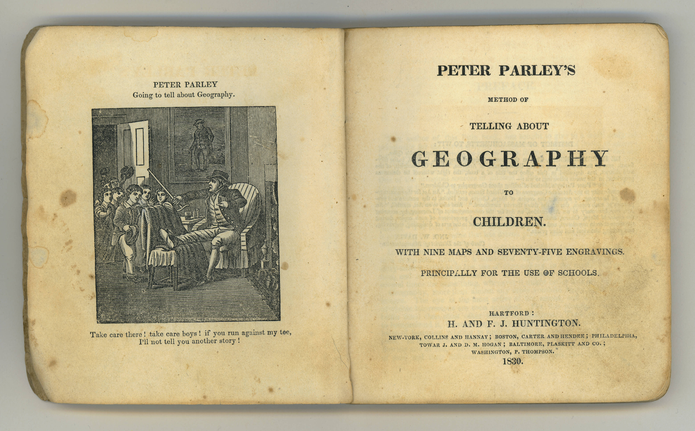

Sets and Sites
--------------
Here are five keywords:

* Apparatus
* Cut
* School
* Home
* Lyceum

This is the introduction to my dissertation. Here is a picture:

And here is an inline footnote.^[Always stick to these. Keep them to one paragraph.] Here is a citation [See @arora_writing_2017, pp. 30-32]. General principles are to use Sublime for the writing since it will be way cleaner. Keep track of dependencies, whether for Pandoc or WSL setup.

Keep styling to separate CSS sheet (for image widths, etc.).

Works Cited
-----------
