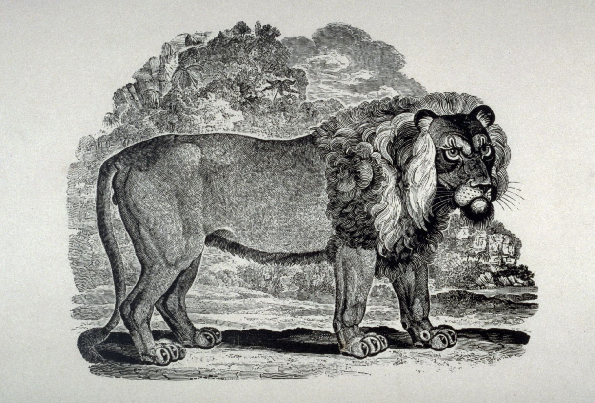

## Introduction

This chapter counterposes the magazine-work of Samuel Goodrich and Nathaniel Hawthorne. These two men had very different approaches to textual editing and production. Nevertheless, it was a magazine--the *American Magazine of Useful and Entertaining Knowledge*--that brought them into sustained contact (and conflict) for the first time. Studying Hawthorne's short tenure as editor of the AMUEK in 1836 reveals the contours of a network of "penny" magazine producers in which he and his predecessor Alfred Bradley participated. Copying was bimodal and bidirectional: text *and* image flowed between London, Paris, and the eastern seaboard cities of the United States. In what follows, I undertake a combination of close and distant reading of illustrations alongside a recovery of how these images were theorized and introduced by their creators and editors. My claim is that Goodrich inaugurates something new through his interactive approach to the Parley Magazine. End with comparison of view points: Hawthorne's view from a steeple and the implicit elevated view (united in the Robinson Crusoe school) but a difference from the embodied Pestalozzian "up-close" view.

Facts about

- Start and end dates
- Frequency
- Price
- Circulation and popularity
- Marketing of pictures (cf. Chambers' Journal which had none)
- Origin of phrase "useful *and* entertaining" knowledge
- Presence or absence of reader mailbags (origin of the same)
- Vocabularies for editing
    * Hackwork
    * Concocting
    * Blocking
- Influence of Bewick

Implicit theories of:

- Illustration
- Affiliating with a particular style (e.g. Bewick)
- Childhood and education
- "Universalism"
- Science
- Race and culture
- Political controversy
- Public sphere

Material evidence for:

- Wood engraving reuse
- "Viral" passages
- Boston and Salem libraries
- Role of Elizabeth Hawthorne
- Number of "blockers" employed by Goodrich

Context regarding:

- The existing literature on Hawthorne as editor
- Victorian visual culture and science
- Print technology
- History of capitalism

## A Patron Saint

The dog days of Summer 1835 had rolled around, and with them the twelfth issue of the inaugural volume of the *American Magazine of Useful Knowledge*, before formal respects were paid to the publisher's namesake:

> It may be considered as rendering tardy justice to the character of our patron saint, in not having long before this, referred to Thomas Bewick, whose name we have used, not profanely we hope, as a recommendation of our well-intentioned work. (AMUK 1.12.507 [August 1834])

Though Bewick had died seven years previously--at 75 in his native Northumberland--a wood engraving of him in middle age with a shock of dark, curly hair and a bemused look serves as the head-piece to the article. The same block reappears on a poster for what was probably the magazine's second volume (there would only ever be three). The relief portrait of the British master artisan sits at the bottom of the broadsheet, bisected by its vertical axis of symmetry. As can be seen in the American Antiquarian Society's copy, however, "Published Monthly, BY The Boston Bewick Co." has been pasted over with a printed cancel. In the company's place, "Noyes P. Hawes. nos. 18 and 20 Cornhill, Boston, Mass." will bring the magazine forth to the public at $2 per annum.

The fungibility of the AMUK's publishing concern is representative of the high turnover in 1830s popular-scientific literature and periodicals. The era of the "growth of knowledge" had been steaming along for a few decades now and American imitations of the SDUK and the *Juvenile Magazine* were many. Yet the short-lived Boston Bewick Co. and its *American Magazine* merit attention for the way in which they thematized the changes in visual arrangement that were taking place at the level of the book, the magazine, the page. Turning to Bewick and his famous "tale-pieces" was both an antiquarian looking back to an old-Country pastoralism but also a looking forward to a world in which the image saturated knowledge publishing.

The editors close their biographical note with a brief critical survey. Bewick's *Quadrupeds* (1799) and other books are fine, but it is his lion that they select as being best.

### Aside: The Great Moon Hoax

The Bewick article appears the same month that *The Sun* in New York printed the moon hoax. Poe's connection to the hoax via Hans Pfaall and air balloons might be of use here. The belatedness of Boston by this point. Cf. Goodrich's own sense of regionalism, competition between Boston and New York. Parley as transcending regionalism (cf. New Orleans visit). In general, connect more to literary nationalism in Jacksonian period. Moon hoax gets its authority by copying from Edinburgh, from UK.

## American Uptake of Penny Magazines

Perhaps the most humorous article of Hawthorne's in the AMUEK is "Fashions of Hats" (August 1836)--not the least because of the 15 small woodcuts that pepper the three columns of text. Hawthorne ends by asking whether men of science, taste, and genius might not "turn their attention" to perfecting the elegance and utility of the hat, thus arriving at a "universal" form of headgear, to be modified only as climate might necessitate. Of course, Hawthorne immediately ironizes this fanciful project: 

## Time on Page, *Mise en Page*

This chapter begins with the American reception of Bewick to show how he stood as a symbol of "growth of knowledge" but also as the principle of authorship in a world of plagiarism and concocting and image reuse.

This chapter continues the thread of thinking about apparatus and cut by addressing a "big" question in literary history. It also reflects on the relationship between early childhood pedagogy and the (pace of) narrative. The main "reading" I will do is of the first Peter Parley book as it reflects Goodrich's career. Cuts and questions and "here is a picture": these are my subject.

Bewick and Goodrich in their memoirs both express as dissatisfaction with the state of children's literature. Work outwards from the memoirs.

Charles Robert Leslie and Am. Journ. Educ. have material on Bewick.

Did the speedup of narrated literary time over the past three centuries have visual analogues? When we consider historical change in the printed *mise en page*, one counterpart phenomenon stands out. Early nineteenth-century wood engravings--especially the popular "vignette" form--were understood by readers as marking a shift in reading's media format and temporality. The career of Samuel Griswold Goodrich, instigator of the short-lived Boston Bewick Company, connects many of the actors and formats involved in this shift. The Bewick Company took its name and characteristic style from the work of the British engraver Thomas Bewick (1753-1828). Active from 1834-????, the company comprised an engraving workshop and various other things.

Before turning to Goodrich's context late-1830s Boston in more detail, however, I want to 

Ted Underwood has argued that changes in literary narration took place gradually. A representative 250 words of narration in an 18C novel will cover several years in time whereas by the 20C a passage of similar length will, on average, narrate just minutes.^[Underwood and two collaborators sampled 90 novels.] [@UnderwoodWhyLiteraryTime2018]

discussion of types of evidence that will be presented; choice of archive

questions AND images became normative in educational children's lit

cf. introduction to 2nd edition of first parley book

If not in the introduction, give good definitions for Plate and diagram and inline image. Or at least a good bibliographical pointer.

## Notes and Ideas

Here's what I have in my notes about Goodrich and Bewick:

Bewick illustrated a Newcastle (?) edition of Newtonian System:

https://books.google.com/books?id=vC0YAAAAMAAJ&pg=RA2-PA11&lpg=RA2-PA11&dq=tom+telescope+newtonian+system+printed+newcastle+thomas+saint&source=bl&ots=QZ-BCBC_kK&sig=5XaQSD4eqzBBL831zGLfWFKszkc&hl=en&sa=X&ved=0ahUKEwiKirzJrczbAhVQoFMKHfDvDwgQ6AEIOzAH#v=onepage&q=tom%20telescope%20newtonian%20system%20printed%20newcastle%20thomas%20saint&f=false

Most accurate info is at Bewick Society website. It seems that Bewick owned a copy of Tom Telescope but probably did not illustrate an edition. Pearson has incorrect information.

- Incorporation of Boston Bewick Co.: http://archives.lib.state.ma.us/handle/2452/106693

- https://catalog.mwa.org/vwebv/holdingsInfo?bibId=225300

- https://rarebookschool.org/about-rbs/history-of-the-lion/lion-story/
- https://georgianera.wordpress.com/2015/05/07/gilbert-pidcocks-travelling-menagerie/
- https://books.google.com/books?id=GDlcAAAAcAAJ&lpg=PA72&ots=hzslTh7EN-&dq=thomas%20bewick%20lion%201819&pg=PA42#v=onepage&q=lion&f=false
- https://books.google.com/books?id=mkoJAAAAQAAJ&lpg=PR24&ots=dvLs8R6GrD&dq=thomas%20bewick%20a%20lion%201819&pg=PR13#v=onepage&q=thomas%20bewick%20a%20lion%201819&f=false
-https://www.britishmuseum.org/research/collection_online/collection_object_details.aspx?objectId=3407664&partId=1&images=true

-http://gallica.bnf.fr/ark:/12148/bpt6k6290222f/
"gravures" indicated with * in the TOC for Magasin Universel

- http://search.ebscohost.com/login.aspx?direct=true&db=h9i&AN=43577607&site=ehost-live&scope=site&kw=true&acc=false&lpId=divl5&ppId=divp66&twPV=null&xOff=0&yOff=0&zm=fit&fs=null&rot=0&docMapOpen=true&pageMapOpen=true
- https://en.wikipedia.org/wiki/Boston_Society_for_the_Diffusion_of_Useful_Knowledge
- Cf. Paul Schlicke on Sketches by Boz (same time)
- https://jwa.org/encyclopedia/article/foa-eugenie

N.B. EBSCO has cool "Document Map" that identifies illustrations. Need to track this down (ask Doug). The Penny Magazine started in 1832 and was stereotyped, appearing at least in American editions in Boston and New York.

Direct copying of Rattlesnake image in AMUEK 2 p. 511 (Hawthorne) [August 1836; this whole issue is interesting because it also has the hats article and a piece on wood engraving; perhaps do a case study?] and Magasin Universel, 10.1 [1853]. Same pattern of 1850s reuse of 1830 material? The afterlife of the 1830s? Michele Martin's analysis fits with the hypothesis that the American and French editions presuppose a British original.

https://babel.hathitrust.org/cgi/pt?id=uiuo.ark:/13960/t3qv4pm6h;view=1up;seq=12

https://archive.org/details/61360050R.nlm.nih.gov (William Andrus Alcott)

## TODO

## Works Cited
