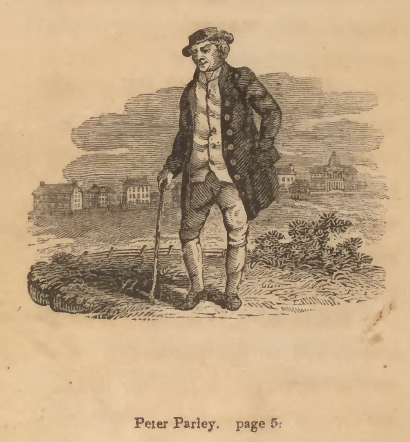

## Note

*Explain context for small group readers.*

###############################################################################
## Introduction

*Already written; revise and make it fit with outline. This section needs to inform the reader about who Peter Parley was and what archive will be used to animate him.*

###############################################################################
## "He ain't Peter Parley"

*This section connects Goodrich's own disability and representational networks with the afterlives of the Parley character and its distributors.*

**Plan**

- [DONE] A trip to the South; footnoting the engravers
- [Written, work it in] importance of Crusoe
- The "Parley" name and brand
- Hannah More and Parley Porter as model; More's interest in Cogswell (166)
- Back to the material and textual sources
    * brother CA Goodrich: Columbian scenes (two publictions)
    * Woodbridge and Alice Cogswell and mental "machinery"
    * "Advances in Education"
- Strange case of the missing gout: never explicitly mentioned in the main sources; only in Recollections footnote
    * In fact, gout explicitly typed in Bible Gazetteer as harming one's relationship with God
- Connection to discourse of 19C sentimentality and sick children
- Physical disability, invalids and narrative "validity", mental disability, by accident vs. by birth, etc.

The reason Samuel Goodrich could not possibly be Peter Parley, according to the young boy in Savannah, was that "he hasn't got his foot bound up, and he don't walk with a crutch!" So keen was the boy's dismay that he told his grandfather he wouldn't have "any thing to do with" Goodrich.  [@GoodrichRecollectionslifetimeMen1857, 323] This anecdote features in Letter 50 of the *Recollections*, in which Goodrich tours the South. The trip culminated in a public reception in New Orleans in March of 1846 at which the author and "friend of education" was toasted by the leading lights of the city's lyceum. Domestic travel presented Goodrich, then 52, with first-hand evidence of his character's popularity. Both adults and children welcomed him "under the name of the fictitious hero whom I had made to tell my stories." As the lyceum president put it: "Mr. Goodrich, or, as we all love to call you, Peter Parley..." (324) The lyceum speechifying documented in the letter traffics in the old ideas of character as a way for authors to inculcate good morals and live on after death. But Goodrich hints at a more complex authorial situation when he admits that, at times, he "underwent rather sharp cross-questioning":

> I, who had undertaken to teach truth, was forced to confess that fiction lay at the foundation of my scheme! My innocent young readers, however, did not suspect me: they had taken all I had said as positively true, and I was of course Peter Parley himself. (322)

Goodrich then dramatizes a scene of interrogation in Mobile, Alabama, in which he owns up to an eight-year-old girl that he has not, in fact, been in prison in Africa or even in Africa at all.

The eight-year-old girl's quiz about the reliability of *Tales about Africa* and the young boy's aversion to the crutchless Goodrich represent two different kinds of truth-seeking behavior, conditioned by age.^[*Tales about Africa* was the fifth of the Parley books and was first published in 1830.] On one view, widely represented in the scholarship on children's literature, growing out of what Goodrich calls the "innocent young reader" stage means learning to take pleasure in one's ability to switch between the fictional and the real, not in fantasy itself. But the juxtaposed reactions of Goodrich's southern readers point to a different economy of character, one in which consistency and availability rather than a bright line dviding truth from fiction are paramount.^[The fact that such switching is how adult's conceptualize the pleasure of fiction should warn us about this approach. See Crain, Lesnik-Oberstein, Sanchez-Eppler, Berube.] Because Goodrich writes in the "useful and entertaining knowledge" genre, the plausibility of his travel writing depends in large part upon how he manages that genre's norms of textual compilation and reuse. A first-person serialized narrator like Parley presents certain difficulties. An editor, either silently or through a virtualized editorial persona, could straightforwardly compile from a range of natural-historical dispatches. But making one character responsible for *all* the facts and adventures in a globetrotting series pushed beyond the limits of plausibility. As a result, the facts might come to be seen in a less factual light. Goodrich, "who had undertaken to teach truth," feels this tension when he speaks to his "young friends" in person.

On the one hand a genre problem: how to incorporate a frame character into "penny magazine"-style prose without undercutting the text's payload of "useful" (even if sensationalized) facts? On the other, a visual inconsistency between an author and his creation. This latter problem has as much to do with techniques of celebrity and capitalist advertising as with literary form. But insofar as both problems are about validity, the figure of the *invalid* provides a way to connect them. The story of how Parley became disabled starts with the story of how Goodrich's personality became sutured to Parley in the first place. Disability hastened their coextension. The inaugural Parley book, the sextodecimo *Tales about America* (1827), had been published anonymously. Goodrich recollects in Letter 47 that he divulged his authorship only to his wife and sister because of literary shyness and the fact that "nursery literature had not then acquired the respect in the eyes of the world it now enjoys." (279) Soon enough, though, the word got out. Certainly by 1832, when Goodrich was already drafting up Parley licensing deals to stem the flow of pirated British editions.^[See also the 1838 jug dispute in which Goodrich was referred to as "neighbor Parley."] 

Parley caused Goodrich "endless vexations" in relation to copyright; but in a quite literal sense he almost killed him upon arrival. In the four years following *Tales about America*, Goodrich worked 14-hour days, dictating to his wife on account of his strained eyesight. In the spring of 1832, he experienced a nervous breakdown and suffered heart palpitations worrying enough to send him off to Europe to convalesce. Compare the initial depiction of Parley in 1827 with those in 1830 and 1831. The 1827 wood engraving (unsigned, but likely done by a Boston workshop) depicts an older gentlemen with a walking stick. The visual emphasis is on *walking*, since Parley is striding away from what is likely the Massachusetts General Hospital at the top right of the vignette.^[Designed by Charles Bulfinch and completed in 1821, the hospital was widely regarded as the most beautiful building in the state. Abel Bowen's contemporaneous *Picture of Boston* described the grounds: "The beautiful hills which surround Boston are seen from every part of the building, and the grounds on the southwest are washed by the waters of the bay. The premises have been improved by the planting of ornamental trees and shrubs, and the extension of the gravel walks for those patients whose health will admit of exercise in the open air." Parley is probably walking on the old "Prince's Pasture." Bowen was Goodrich's friend and founded the Boston Bewick Company, which I discuss in relation to Nathaniel Hawthorne in the next chapter.] The later Parleys are laid up in chairs, with bandaged right feet. The walking stick has morphed into a crutch, with its distinct underarm support. Goodrich declines to "weary" the reader with the details of this "busy and absorbed period" of his life (280). But the shock of Parley, in terms of the character's unexpected commercial success and the ensuing incitement to overwork, registers iconographically in a walking disability. The quickness of this physical decline is humorously embedded in the frontispiece wood engraving to the *Method of Telling about Geography*: Parley reclines grumpily by the hearth, warding off the approach of seven children. Above him on the wall? A large framed portait of the 1827 Parley, walking confidently away from the hospital and onto the Boston Common.^[Though the destruction of Goodrich's correspondence makes it difficult to prove, my sense is that Goodrich went back to his Hartford circle for the *Geography*. The embedded portrait might be Tisdale's way of asserting himself over Bowen? TODO: is there a Tisdale archive? Bowen?]

The perambulating Parley and the bum leg Parley were each memorable in their own way. Stephen Dedalus remembers the former in *Portrait of the Artist*:

> History was all about those men and what they did and that was what Peter Parley's Tales about Greece and Rome were all about. Peter Parley himself was on the first page in a picture. There was a road over a heath with grass at the side and little bushes: and Peter Parley had a broad hat like a Protestant minister and a big stick and he was walking fast along the road to Greece and Rome.

As the editors of James Joyce Online Notes point out, Joyce has gotten himself mixed up here. Tales of Greece and Rome appeared, respectively, in ^[I am indebted for this reference to: http://www.jjon.org/joyce-s-allusions/peter-parley.] []

OK, wow. There is a complicated story here. See Switaj. The Blackie and Sons edition of Parley's Tales about Greece and Rome (the only title that actually matches what Joyce records) is probably the one we want. It was published sometime before 1901. Joyce does not have Parley in Stephen Hero, abandoned around 1904. But in 1917 Parley appears in Portrait (what about in drafts?)

> The little book entitled "*Parley's Method of Telling about Geography to Children*," had a picture, drawn by Tisdale, representing Parley sitting in a chair, with his lame foot bound up, and a crutch at his side, while he is saying to the boys around--"Take care, don't touch my gouty toe; if you do, I won't tell you any more stories!" Of this work two millions were sold, and of course Parley and his crutch were pretty generally associated together, in the minds of children. (323-324n.)

###############################################################################

![Fifth edition. Boston: Carter and Hendee, 1831. Signed by E[lkanah] Tisdale and F. G. Perkins. "HERE I am! My name is Peter Parley! I am an old man. I am very gray and lame. But I have seen a great many things, and had a great many adventures, and I love to talk about them." The Tisdale engraving also appears in the French edition (1832).](img/tales-america-5-tisdale.png)
###############################################################################

Disability can be read as addressing this problem by widening the gap between the situation of a tale's telling and the notional context in which it took place. 

If character an effect of visual iconography. Goodrich footnotes the boy's exclamation that "he ain't Peter Parley."

[Show the pictures. Justify why I am NOT writing a reception history in the usual sense. Actually, the gout thing seems to not have been important. This disease would have had unfavorable connotations. Start Friday by using the Bourrier book; Parley as mix between C18 humor and C19 pathos.]

**Sources**

- Goodrich, Recollections [@GoodrichRecollectionslifetimeMen1857]
- Pfliegl, "Parley as Brand"
- Brewer, Afterlife of Character
- Russell, Am. Journal on Parley's "avowed reuse"

###############################################################################
## Practical Education at the Limit

Woodbridge, Gallaudet, Howe. 

###############################################################################
## Disabled Bodies, Enabled Attention?

The disabled pay attention in different ways. Close reading of Parley's magazine passage. Close reading of the Parley book. How norms for attention changed.

###############################################################################
## TODO

- Complete outline
- Decide on sources
- Define what I mean by disability
- Contrast physical to mental impairment in Goodrich's world (the list of narrators with mental disability in modernist fiction is huge)
- Caspar Hauser in Parley's Magazine
- Key role of Alice Cogswell

###############################################################################
## Works Cited
